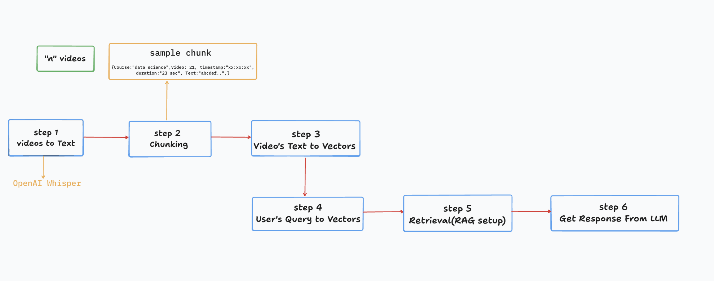

# 📚  QueryCast - RAG Based Video Knowledge Assistant

This project is a **Retrieval-Augmented Generation (RAG)** AI Teaching Assistant. It uses your own video course data to answer student questions with **video titles, timestamps, and summarized explanations**.

---

## 📝 How to Use This QueryCast - RAG AI Teaching Assistant on Your Own Data

### Step 1 – Collect Your Videos

Move all your video files to the `videos` folder.

### Step 2 – Convert Videos to MP3

Convert all the video files to MP3 by running:

```bash
python videos_to_mp3.py
```

### Step 3 – Convert MP3 to JSON

Convert all the MP3 files to JSON by running:

```bash
python mp3s_to_jsons.py
```

### Step 4 – Convert JSON Files to Vectors

Use the `process_jsons.py` script to convert the JSON files to a dataframe with embeddings and save it as a **joblib pickle**:

```bash
python process_jsons.py
```

### Step 5 – Prompt Generation and Feeding to LLM

1. Load the joblib file into memory.
2. Create a **relevant prompt** using the user query.
3. Feed it to the LLM (for example `llama3.2:latest`).
4. **Store the LLM response in a file called `response.txt`**:

```python
with open("response.txt", "w") as f:
    f.write(llm_response)
```

---

# 🛠 How I Created This Project

## Workflow Pipeline of System Architecture


---

### 1. Download Video from YouTube

We use \[`yt-dlp`] to download videos in **144p** quality:

```bash
yt-dlp -f "bestvideo[height=144]+bestaudio/best[height=144]" "ytvideo.link"
```

### 2. Convert Video to MP3

Once the video is downloaded (in `.webm` format), use `ffmpeg` to convert it into an MP3 file:

```bash
ffmpeg -i "input_video_name.webm" output_audio_file.mp3
```

### 3. Generate Chunks Using Whisper

We used the Whisper **“medium”** model to create transcripted chunks from the MP3 files. This also allows **Hindi to English translation**. We stored these transcripted chunks into the `jsons` folder, creating a separate folder per video.

### 4. Create Vector Embeddings

We used **bge-m3** (via Ollama) to create vector embeddings of the chunked transcripted text. We also created vector embeddings of the **user query** to match them with the most relevant answer chunks.

* **Similarity search:** cosine similarity.
* **Top results:** We take the **top 5 matching chunks** for each user query.

### 5. Feed to LLM

We used **llama3.2\:latest** as the open-source LLM. After retrieving the top chunks, we feed them to the LLM with a well-designed prompt.

### 6. LLM Response Format Example

User Query:

> Where was meta description mentioned in this course, that it is important for SEO?

LLM Response:

```
Meta description is mentioned as an important keyword for SEO in Video 3 called "Basic Structure of an HTML Website".

Video 3: "Basic Structure of an HTML Website"

• 0:48 – 0:50 → Definition of Meta description
• 0:49 – 0:51 → Importance of meta description for SEO
• 1:03 – 1:05 → Brief explanation of Google's use of meta description

Tip: Watch from the beginning (around 0:44) to understand the full context.
```

### 7. Save LLM Response

Finally, we store the generated response into `response.txt`:

```python
with open("response.txt", "w") as f:
    f.write(llm_response)
```

---

## 📝 Key Features

* Retrieval-Augmented Generation (RAG) pipeline.
* Fully automated processing of course videos.
* Timestamp conversion to **minutes\:seconds format**.
* Context-aware answers with **video number + title + timestamps**.
* Responses stored in `response.txt` for easy retrieval.

